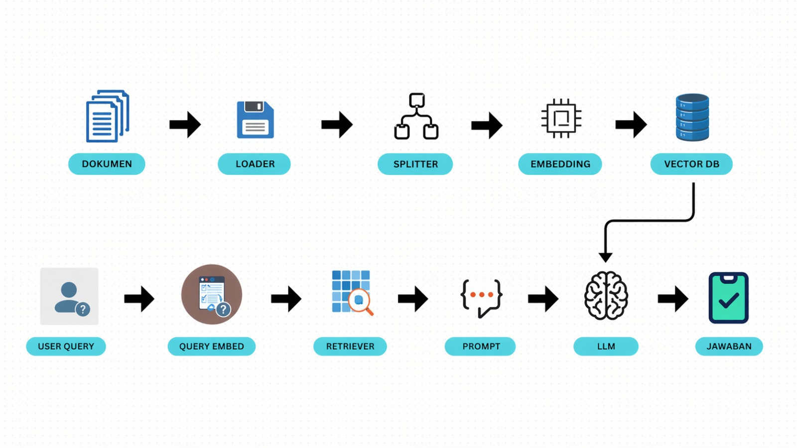

# 🤖 RAG Starter Pack — UTS Data Engineering

> **Retrieval-Augmented Generation** — Sistem Tanya-Jawab Cerdas Berbasis Dokumen

Starter pack ini adalah **kerangka awal** proyek RAG untuk UTS Data Engineering D3/D4.
Mahasiswa mengisi, memodifikasi, dan mengembangkan kode ini sesuai topik kelompok masing-masing.

---

## 👥 Identitas Kelompok

| Nama | NIM | Tugas Utama |
|------|-----|-------------|
| Fathur Roshin Haddinanta  | 244311014 | Project Manager         |
| Kevin Rafael Suryatmoko  | 244311017 | Data Engineer         |
| Muhammad Rifqi Maulana  | 244311018 | Data Analyst         |

**Topik Domain:** *Kesehatan*  
**Stack yang Dipilih:** *From Scratch*  
**LLM yang Digunakan:** *Gemini*  
**Vector DB yang Digunakan:** *ChromaDB*  

---

## 🗂️ Struktur Proyek

```
rag-uts-kelompok2/
├── data/                    # Dokumen sumber (PDF, TXT)
│   └── sample.txt           # dokumen
├── src/
│   ├── indexing.py          # Pipeline indexing
│   ├── query.py             # Pipeline query & retrieval
│   ├── embeddings.py        # Konfigurasi embedding
│   └── utils.py             # Helper functions
├── ui/
│   └── app.py               # Antarmuka Streamlit
├── docs/
│   └── arsitektur.png       # Diagram arsitektur
├── evaluation/
│   └── hasil_evaluasi.xlsx  # Tabel evaluasi 10 pertanyaan
├── notebooks/
│   └── 01_demo_rag.ipynb    # Notebook demo dari hands-on session
├── .env.example             # Template environment variables
├── .gitignore
├── requirements.txt
└── README.md
```

---

## ⚡ Cara Memulai (Quickstart)

### 1. Clone & Setup

```bash
# Clone repository ini
git clone https://github.com/fathursn21/rag-uts-kelompok2.git
cd rag-uts-kelompok2

# Buat virtual environment
python -m venv venv
source venv/bin/activate        # Linux/Mac
atau: venv\Scripts\activate   # Windows

# Install dependencies
pip install -r requirements.txt
```

### 2. Konfigurasi API Key

```bash
# Salin template env
cp .env.example .env

# Edit .env dan isi API key Anda
# JANGAN commit file .env ke GitHub!
```

### 3. Siapkan Dokumen

Letakkan dokumen sumber Anda di folder `data/`:
```bash
# Contoh: salin PDF atau TXT ke folder data
cp dokumen-saya.pdf data/
```

### 4. Jalankan Indexing (sekali saja)

```bash
python src/indexing.py
```

### 5. Jalankan Sistem RAG

```bash
# Dengan Streamlit UI
streamlit run ui/app.py

# Atau via CLI
python src/query.py
```

---

## 🔧 Konfigurasi

Semua konfigurasi utama ada di `src/config.py` (atau langsung di setiap file):

| Parameter | Default | Keterangan |
|-----------|---------|------------|
| `CHUNK_SIZE` | 500 | Ukuran setiap chunk teks (karakter) |
| `CHUNK_OVERLAP` | 50 | Overlap antar chunk |
| `TOP_K` | 20 | Jumlah dokumen relevan yang diambil |
| `MODEL_NAME` | gemini-3-flash-preview | Nama model LLM yang digunakan |

---

## 📊 Hasil Evaluasi

| # | Pertanyaan | Jawaban Sistem | Jawaban Ideal | Skor (1-5) |
|---|---|---|---|:---:|
| 1 | Jika saya meminum 1 liter minyak, apa yang akan terjadi pada tubuh saya? | Menjelaskan ambang batas konsumsi lemak (47g), risiko steatore (feses berminyak), dan dampak kolesterol berdasarkan regulasi kesehatan. | Penekanan pada efek instan: diare berat, feses cair, mual, dan sakit perut akibat ketidakmampuan mencerna lemak masif. | 4 |
| 2 | Saya meminum es teh jumbo sebanyak 10 gelas, apakah nanti saya akan terkena diabetes? | Mengacu pada batasan gula harian (50g) dan prinsip 3J, serta menyatakan tidak ada info spesifik tentang "10 gelas es teh" secara langsung. | Menegaskan bahwa konsumsi drastis tersebut meningkatkan risiko diabetes secara signifikan, terutama jika menjadi kebiasaan. | 4 |
| 3 | Saya didiagnosis terkena diabetes, pola hidup seperti apa yang perlu saya ikuti? | Memberikan panduan komprehensif: Diet 3J, aktivitas fisik (kapan harus mulai/tunda), kepatuhan obat, dan kontrol medis. | Penerapan konsisten 3J (Jumlah, Jadwal, Jenis), aktivitas fisik, dan pemantauan mandiri untuk mencegah komplikasi. | 5 |
| 4 | Berapa anjuran konsumsi sayuran dan buah-buahan per hari bagi remaja dan orang dewasa? | Menyebutkan angka 400-600 gram per hari dengan rincian porsi mangkuk/buah berdasarkan Permenkes dan WHO. | Konsumsi sayuran dan buah-buahan menurut Kemenkes RI adalah 400-600 gram per orang per hari. | 5 |
| 5 | Jika saya memakan 10 kg tempe, apakah saya tidak perlu makan selama 2 hari? | Menjelaskan prinsip pola makan teratur, keseimbangan nutrisi ("Piring Makanku"), dan kapasitas lambung yang tidak mendukung ide tersebut. | Secara fisiologis tidak disarankan dan tidak bisa menggantikan frekuensi makan selama 2 hari. | 5 |
| 6 | Apakah nasi goreng dapat menyebabkan pusing? | Menyatakan tidak ada informasi di dokumen, namun menyarankan hindari makanan berlemak jika mual/pusing. | Ya, bisa disebabkan kontaminasi bakteri *Bacillus cereus*, kadar lemak/garam tinggi, atau perubahan tekanan darah. | 3 |
| 7 | Apa risiko kesehatan jika konsumsi gula, natrium, dan lemak berlebih? | Merinci risiko spesifik: Diabetes tipe-2, hipertensi, stroke, serangan jantung, hingga ketoasidosis dan obesitas. | Meningkatkan obesitas, diabetes tipe 2, hipertensi, stroke, penyakit jantung koroner, hingga perlemakan hati. | 5 |
| 8 | Jelaskan secara ilmiah penyebab masuk angin? | Mengaitkan istilah tersebut dengan paparan suhu dingin, infeksi virus (influenza), dan faktor lingkungan (debu/kipas angin). | Menurunnya daya tahan tubuh akibat cuaca, kurang tidur, atau telat makan, memicu kerentanan infeksi atau akumulasi gas. | 4 |
| 9 | Apakah makan makanan yang berminyak dapat menyebabkan penyakit kronis? | Mengonfirmasi hubungan lemak trans/jenuh dengan kolesterol, penyakit jantung koroner, diabetes, dan kanker. | Ya, risiko utama berasal dari lemak jenuh, lemak trans, dan kalori tinggi yang memicu obesitas dan penyakit kardiovaskular. | 5 |
| 10 | Pada ibu hamil trimester 1, berapa porsi protein hewani, sayur, buah, serta batasan garam dan air? | Merinci: 4 porsi protein hewani, 4 porsi sayur, 4 porsi buah (estimasi), 1 sdt garam, dan 8-12 gelas air. | Fokus pada kualitas: 3-4 porsi protein hewani, 4 porsi sayur, dan 4 porsi buah per hari. | 5 |

**Rata-rata Skor:** 4.5  
**Analisis:** .Kelemahan utama sistem RAG kelompok kami terletak pada ketergantungan yang terlalu kaku terhadap teks dokumen (strict context), sehingga gagal melakukan penalaran logis terhadap kasus ekstrem seperti konsumsi dosis tinggi dan risiko penyakit akut yang tidak tertulis secara eksplisit, serta adanya kendala chunking yang menyebabkan informasi pada tabel porsi gizi terpotong. 
Saran perbaikan ke depannya yaitu dengan memperbesar ukuran CHUNK_SIZE misal menjadi 1000 agar informasi tabel tidak terpotong, serta memperbarui Prompt pada model Gemini agar lebih memberikan analisis logis atau peringatan medis meskipun informasi spesifik tidak tertulis di dokumen. Selain itu, menambah TOP_K agar sistem mendapatkan lebih banyak referensi dokumen untuk merangkai jawaban yang lebih relevan.

---

## 🏗️ Arsitektur Sistem



---

## 📚 Referensi & Sumber

- Framework: *-*
- LLM: *Gemini*
- Vector DB: *ChromaDB*
- Tutorial yang digunakan: *https://github.com/mrdbourke/simple-local-rag*
- Sumber data:

| No | Judul Dokumen | Penulis / Penerbit | Tahun | Keterangan / Lisensi |
|:---:|---|---|:---:|---|
| 1 | Buku Pedoman Manajemen Diabetes untuk Pasien dan Keluarga | Ns. Ni Wayan Trisnadewi, dkk. (Baswara Press) | 2022 | CC-BY-NC-ND 4.0 |
| 2 | Panduan Praktik Klinis Bagi Dokter di Fasilitas Pelayanan Kesehatan Tingkat Pertama | Pengurus Besar Ikatan Dokter Indonesia (PB IDI) | 2017 | Hak Cipta © 2017 PB IDI |
| 3 | Buku Kesehatan Ibu dan Anak (KIA) | Kementerian Kesehatan Republik Indonesia | 2024 | Hak Cipta © Kemenkes RI |
| 4 | Peraturan Menteri Kesehatan RI Nomor 41 Tahun 2014 tentang Pedoman Gizi Seimbang | Kementerian Kesehatan Republik Indonesia | 2014 | Domain Publik |
| 5 | Indo-Online Health Consultation & Nutrition Dataset | Dataset Publik | 2023 | Ekstraksi sesi tanya jawab medis dan data nutrisi makanan lokal |
| 6 | Indonesian Food and Drink Nutrition Dataset | Anas Fikri Hanif (Kaggle) / Kemenkes RI | 2024 | Domain Publik. Diambil dari Tabel Komposisi Pangan Indonesia (https://www.panganku.org)|

---

## 👨‍🏫 Informasi UTS

- **Mata Kuliah:** Data Engineering
- **Program Studi:** D4 Teknologi Rekayasa Perangkat Lunak
- **Deadline:** 23 April 2026
